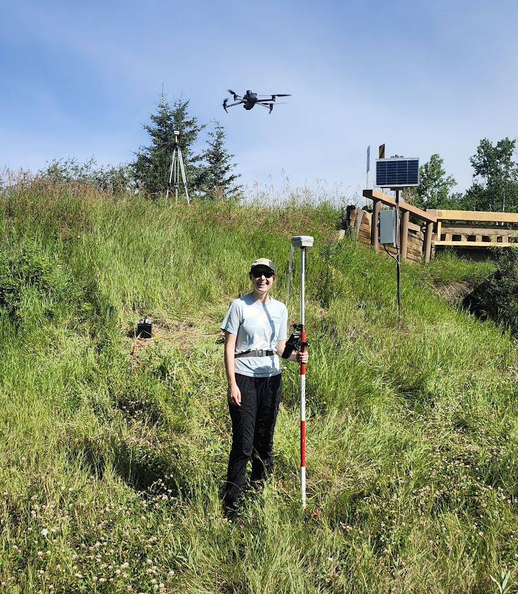
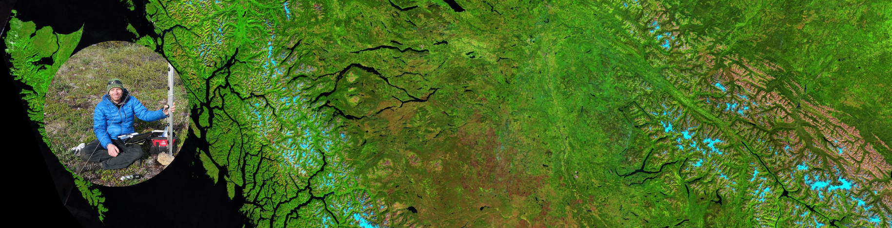

::: {.column-margin}
::: {.news-scroll}

News

<i class="bi bi-journal-text"></i>

July 2026
Contributed ground temperature data to a new [standardized permafrost database for Canada](https://doi.org/10.5194/essd-2026-96), led by colleagues at the University of Ottawa.

<i class="bi bi-people"></i>

May 2026
Co-hosted a free [Community Hydrometric Monitoring workshop](courses.qmd) at UNBC with the Upper Fraser Fisheries Conservation Alliance --- 60 participants from First Nations, academia and government.

<i class="bi bi-image"></i>

March 2026
Contributed to the [UNBC Glacier Gallery](https://ckpgtoday.ca/2026/03/18/discover-unbcs-glacier-gallery-curated-by-students-and-faculty/), a photographic and cartographic exhibit curated by students and faculty.

<i class="bi bi-easel"></i>

February 2026
NRESi Colloquium talk at UNBC: [From the Arctic to northern BC](https://video.unbc.ca/media/Alex+Bevington+-+From+the+Arctic+to+Northern+British+Columbia%3A+Recent+observations+from+the+perspective+of+a+hydrologist%2C+geospatial+scientist%2C+and+overall+optimist+-+NRESi+presentation+Friday+6+Feb+2026/0_4el4s9a8/23996) (recording).

<i class="bi bi-newspaper"></i>

January 2026
Profiled as a member of the Northern Studies group in [The Northern Voice](https://www.unbc.ca/sites/default/files/sections/northern-studies/202601-northern-voice.pdf).

<i class="bi bi-journal-text"></i>

2026
New paper in *The Cryosphere* on [satellite telemetry of surface ablation](https://doi.org/10.5194/tc-20-811-2026) at Place Glacier, using loggers built in the lab.

<i class="bi bi-database"></i>

2026
Released the [Place Glacier smart ablation stake data](https://doi.org/10.5281/zenodo.18392420) and the [RemoteLogger code and wiring diagrams](https://doi.org/10.5281/zenodo.18392144) on Zenodo.

<i class="bi bi-code-square"></i>

2026
[BatchPlanet](https://doi.org/10.21105/joss.09268), an R package for batch access to PlanetScope imagery, published in the *Journal of Open Source Software*.

<i class="bi bi-journal-text"></i>

2026
Co-authored a study on [TTOP permafrost model performance across northern Canada](https://doi.org/10.5194/tc-20-2375-2026) in *The Cryosphere*.

2026
Siobhan Klassen and James Laing joined the lab as [NSERC USRA](people.qmd) undergraduate research assistants.

<i class="bi bi-mortarboard"></i>

2026
Dr. Kristen Kieta joined as a [postdoctoral researcher](people.qmd), co-supervised with Dr. Philip Owens.

<i class="bi bi-mic"></i>

2026
Interviewed on Radio-Canada *Phare Ouest* --- [comment conserver l'eau dans un contexte de sécheresse?](https://ici.radio-canada.ca/ohdio/premiere/emissions/phare-ouest/segments/rattrapage/2444891/comment-conserver-eau-durant-secheresse-dans-centre-c-b)

<i class="bi bi-mic"></i>

2026
Interviewed on CBC *Daybreak North* about [optimism and northern watersheds](https://www.cbc.ca/listen/live-radio/1-109-daybreak-north/clip/16196331-unbc-lecturer-optimism-northern-watersheds).

<i class="bi bi-thermometer-half"></i>

November 2025
Co-organized the [Northern BC Stream Temperature Symposium](https://hcilab.ca/sts/) at UNBC with Dr. Siraj ul Islam.

<i class="bi bi-journal-text"></i>

2025
[Exceptional rise of transient snowlines](https://doi.org/10.1088/1748-9326/adc9ca) across western North America and Alaska, published in *Environmental Research Letters*.

Full lists: [publications](pubs.qmd) · [outreach and media](outreach.qmd) · [workshops](courses.qmd)

:::
:::

Hello! My name is Alex Bevington. I am an Assistant Professor in [Geography, Earth and Environmental Sciences](https://www.unbc.ca/department-geography-earth-and-environmental-sciences) at the University of Northern British Columbia, and a Licensed Professional Agrologist. My interests are wide-ranging, but are generally captured by the following themes: Hydrology, Cryosphere, Geography, and Earth Observation.

Before joining UNBC I spent a decade with the BC Ministry of Forests as a Research Earth Scientist and then Research Hydrologist, work that still shapes how the lab operates: applied, open, and built around data that practitioners can actually use.

I lead the **Watershed Remote Sensing Lab (Wat-RS)**. The motivation of the lab is to tackle wicked problems in the world of water security and public safety, and contribute to solutions with science and research.

# Current Projects

## RemoteLogger for Model Validation
::: {.callout-note collapse="true"}
## Project information
*Low-cost real-time data loggers*\
<https://watershed-rs.shinyapps.io/remotelogger/>\
We are developing modular, low-cost, and low-power loggers for hydrological and environmental monitoring. The RemoteLogger system integrates in-situ sensors (e.g., water level, snow depth, water temperature) with real-time communication capabilities (e.g., wifi, LTE, or Iridium), offering scalable monitoring solutions for remote areas. RemoteLogger aimes to help democratize access to environmental data by reducing costs while maintaining scientific-grade reliability.
:::

## watershedBC for Decision Support
::: {.callout-note collapse="true"}
## Project information
*Interactive watershed information platform*\
<https://bcgov-env.shinyapps.io/watershedBC/>\
WatershedBC is an open-access decision-support tool that enables users to quickly visualize and extract key information about watersheds across British Columbia. Designed for practitioners, researchers, and the public, it leverages provincial datasets and automated workflows to deliver insights on hydrology, land cover, and climate attributes at nested watershed scales.
:::

## Keeping up with Rapid Cryospheric Change
::: {.callout-note collapse="true"}
## Project information
The cryosphere---including glaciers, snow, and permafrost---is one of the most visible indicators of climate change in western Canada. We combine in-situ measurements (mass balance, snow depth, borehole permafrost temperatures) with satellite observations and conceptual models to monitor change and explore its consequences for water resources, ecosystems, and communities. This work provides critical data for water supply planning, hazard assessments, and long-term climate adaptation strategies.
:::

## Understanding Slope Stability and Hazards
::: {.callout-note collapse="true"}
## Project information
Landslide hazards represent a significant risk to infrastructure and communities, particularly in mountainous terrain. This project focuses on building robust InSAR workflows using Sentinel-1, RADARSAT Constellation Mission, and future missions (e.g., NASA--ISRO NISAR) to detect and track precursory slope deformation. Our objective is to transition InSAR from a research tool into an operational, near-real-time monitoring system that can support emergency management and land-use planning.
:::

## Water Temperature Dynamics in Freshwater
::: {.callout-note collapse="true"}
## Project information
Water temperature regulates ecological processes and habitat viability for fish and other aquatic life. We are integrating field-based temperature monitoring networks with thermal infrared remote sensing and hydrological models to better understand the spatial and temporal dynamics of stream and lake temperatures. These datasets will help predict thermal stress on ecosystems under climate change and guide management strategies for cold-water refugia.
:::

## Shallow Surface Water and Groundwater Interactions
::: {.callout-note collapse="true"}
## Project information
Surface water and groundwater are often managed as separate resources, but inmost watersheds they are a single connected system. Where and when that exchange happens controls low flows in late summer, the persistence of cold-water refugia, and how quickly a watershed recovers from drought or disturbance.
:::

## Integrated Remote Sensing Analysis
::: {.callout-note collapse="true"}
## Project information
Our lab takes on a broad portfolio of remote sensing projects, reflecting the versatility of geospatial technologies. Current and past work includes: Time-series analysis of vegetation and disturbance dynamics; Development of novel cloud-free mosaic generation approaches; Multisensor fusion for forest attribute mapping; and Detection and attribution of human impacts on landscapes over time. This theme highlights classification, change detection, and statistical modeling of environmental processes using Earth observation data.
:::

# Partners

We work with First Nations, government agencies, fisheries authorities, and
academic collaborators across British Columbia. Our research is shaped by the
questions these partners bring forward.

<b>First Nations</b>\
- [Blueberry River First Nations](https://blueberryfn.ca/)\
- [Takla Nation](https://www.taklafn.ca/")\
- [Tsay Keh Dene Nation](https://tsaykehdene.com/")\
- [Lheidli T'enneh First Nation](https://www.lheidli.ca/)\
- [Upper Fraser Fisheries Conservation Alliance](https://www.uffca.ca/")\
- [Skeena Fisheries Commission](https://skeenafisheries.ca/")\
- [Gitanyow Fisheries Authority](https://gitanyowfisheries.com/)\
\
<b>Stewardship Organizations</b>\
- [Nechako Environment and Water Stewardship Society](https://www.newssociety.org/)\
\
<b>Provincial</b>\
- [BC Ministry of Forests — Research](https://www2.gov.bc.ca/gov/content/industry/forestry)\
- [BC Ministry of Water, Land and Resource Stewardship](https://www2.gov.bc.ca/gov/content/governments/organizational-structure/ministries-organizations/ministries/water-land-resource-stewardship)\
- [BC Energy Regulator](https://www.bc-er.ca/)\
\
<b>Academic</b>\
- [VIU — Coastal Hydrology Researcg Lab - Dr. Bill Floyd](https://www.viu-hydromet-wx.ca/)\
- [UNBC — Cryosphere Lab - Dr. Brian Menounos](https://couplet.unbc.ca/)\
- [UNBC — Mountain Snow Hydrology Lab - Dr. Joseph Shea](https://www.moshlab.org/what-we-do)\
- [UNBC — Hydroclimate Infomatics Lab - Dr. Siraj ul Islam](https://hcilab.ca/)\
- [UNBC — Northern Hydrometeorology Group - Dr. Stephen Déry](https://web.unbc.ca/~sdery/)\
